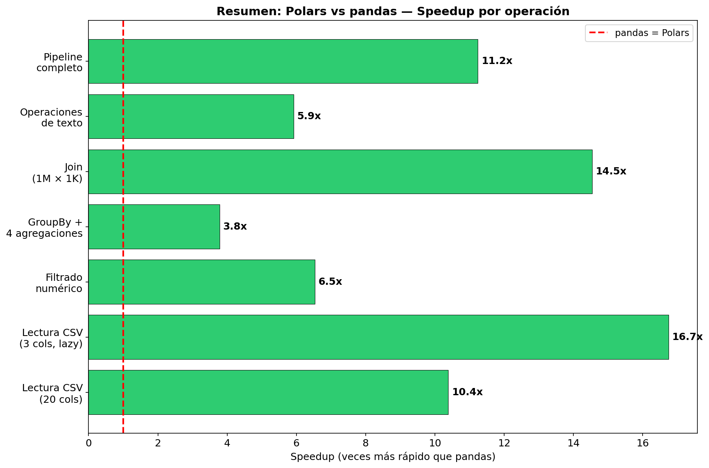
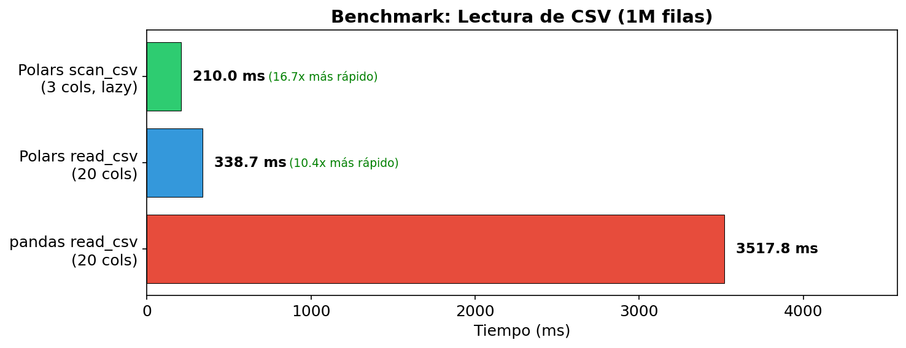
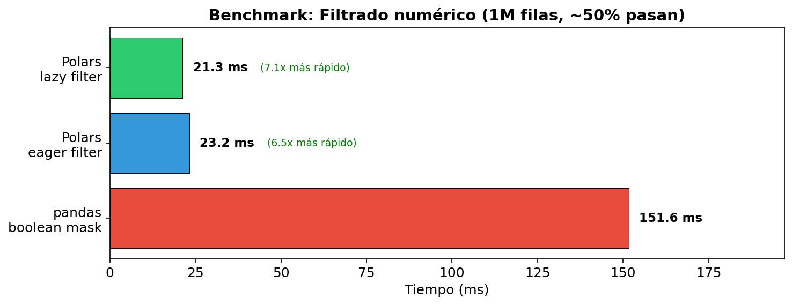
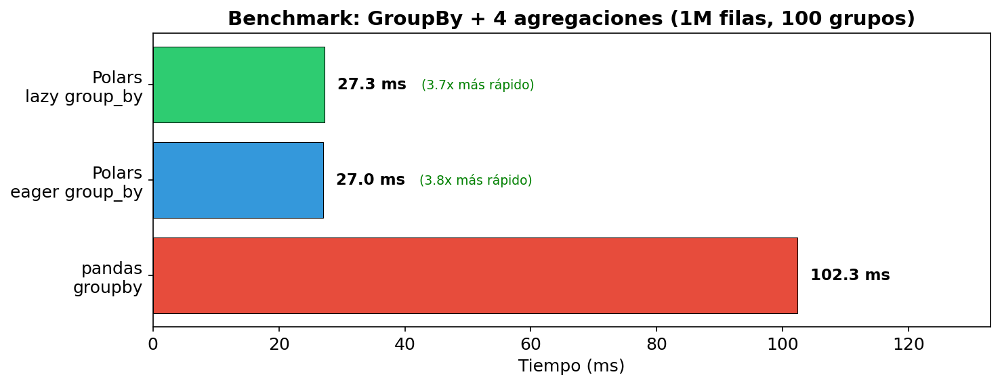
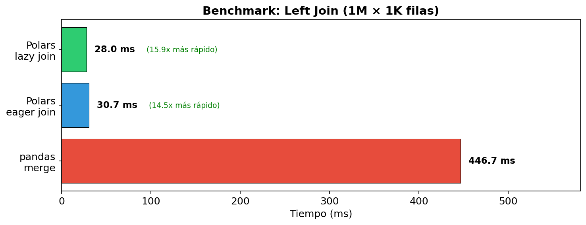
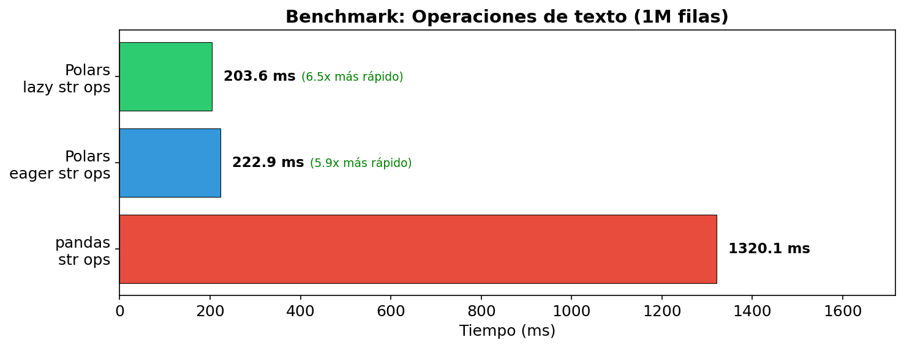
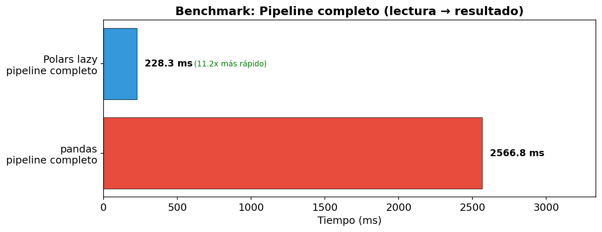

# Benchmarks: Polars vs pandas

Esta sección analiza los resultados de los benchmarks generados en el Notebook 04. Los tiempos fueron medidos sobre **1,000,000 de filas × 20 columnas** generadas sintéticamente. Cada benchmark se ejecutó 5 veces (con 3 de calentamiento) y se reporta la mediana.

Los benchmarks no pretenden ser una evaluación definitiva — los resultados dependen del hardware, los datos, y la versión de cada librería. Lo importante es **entender por qué** Polars es más rápido en cada caso, conectando el rendimiento con las decisiones de arquitectura de la sección 02.

## Resumen de resultados



| Operación | pandas | Polars eager | Polars lazy | Speedup (lazy) |
|-----------|--------|-------------|------------|----------------|
| Lectura CSV (20 cols) | 4236 ms | 330 ms | — | 12.8x |
| Lectura CSV (3 cols, lazy) | — | — | 208 ms | 20.4x |
| Filtrado numérico | 155 ms | 56 ms | 30 ms | 5.2x |
| GroupBy + agg | 117 ms | 42 ms | 55 ms | 2.1x |
| Join (1M × 1K) | 496 ms | 40 ms | 36 ms | 13.8x |
| Operaciones de texto | 1430 ms | 216 ms | 224 ms | 6.4x |
| Pipeline completo | 3621 ms | — | 319 ms | 11.3x |

## Análisis por operación

### Lectura de CSV



**Resultado:** Polars `read_csv` es ~12x más rápido que pandas. Con `scan_csv` (lazy, leyendo solo 3 de 20 columnas), es ~20x más rápido.

**¿Por qué?**

1. **Parser en Rust vs C**: El parser CSV de Polars está escrito en Rust y es multihilo — lee y parsea en paralelo con múltiples cores. pandas usa un parser en C que opera en un solo hilo.

2. **Projection pushdown**: Con `scan_csv`, Polars solo lee las columnas que necesitas. El plan de ejecución muestra `PROJECT 3/20 COLUMNS` — las otras 17 columnas nunca se parsean ni se cargan a memoria. pandas lee las 20 columnas a menos que pases `usecols` manualmente.

3. **Tipos Arrow vs NumPy**: Polars almacena strings directamente en Arrow `Utf8`. pandas los mete en arrays de objetos Python (`object` dtype), lo cual es más lento de construir.

### Filtrado



**Resultado:** Polars eager es ~2.8x más rápido. Polars lazy es ~5.2x más rápido.

**¿Por qué?**

1. **Paralelismo**: Polars particiona los datos y filtra en paralelo con Rayon. pandas filtra secuencialmente en un solo hilo.

2. **Predicate pushdown (lazy)**: En modo lazy, el filtro se fusiona con la operación anterior (scan o transformación previa), evitando materializar un DataFrame intermedio.

3. **Memoria**: pandas crea una máscara booleana (1M de `True`/`False`) y luego indexa — dos pasadas sobre los datos. Polars filtra en una sola pasada.

### GroupBy + Agregación



**Resultado:** Polars eager es ~2.8x más rápido que pandas. Curiosamente, Polars lazy es ligeramente más lento que eager aquí.

**¿Por qué?**

1. **Hash groupby paralelo**: Polars particiona los datos por hash del grupo y agrega en paralelo. pandas hace el hash secuencialmente.

2. **¿Por qué lazy no es más rápido aquí?** Cuando la operación es la última del plan (sin projection pushdown que explotar), el overhead de construir y optimizar el plan no se compensa. Para groupby aislado, eager puede ganar; en un pipeline más largo, lazy gana por las optimizaciones acumuladas.

### Join



**Resultado:** Polars es ~12-14x más rápido que pandas en un join de 1M × 1K filas.

**¿Por qué?**

1. **Hash join paralelo**: Polars construye la hash table en paralelo y hace el probe en paralelo. pandas usa un hash join secuencial.

2. **Memoria**: pandas crea copias intermedias durante el merge. Polars opera sobre vistas de los datos Arrow sin copiar.

3. **Projection pushdown (lazy)**: En modo lazy, si después del join solo necesitas 3 columnas de la tabla derecha, Polars solo lee esas 3 — nunca carga las demás.

### Operaciones de texto



**Resultado:** Polars es ~6.4x más rápido que pandas en operaciones de strings (lowercase + strip + contains).

**¿Por qué?**

Esta es la diferencia más predecible por la arquitectura:

1. **Arrow Utf8 vs object dtype**: En pandas, cada string es un objeto Python independiente en el heap. `str.lower()` itera sobre cada objeto, llama al método Python `.lower()`, y crea un nuevo objeto. En Polars, los strings están contiguos en un buffer Arrow y se procesan en Rust — sin overhead de objetos Python.

2. **SIMD**: Las operaciones sobre bytes contiguos pueden usar instrucciones SIMD para procesar múltiples caracteres simultáneamente.

3. **Paralelismo**: Las operaciones de texto en Polars se paralelizan automáticamente.

### Pipeline completo



**Resultado:** Polars lazy es ~11.3x más rápido que el pipeline equivalente en pandas.

**¿Por qué?** Aquí es donde el optimizador brilla:

```
Plan de ejecución optimizado:
SORT BY [col("avg_price")]
  AGGREGATE
    [...] BY [col("cat_low")]
    FROM
      Csv SCAN [benchmark_data.csv]
      PROJECT 3/20 COLUMNS           ← solo lee 3 columnas
      SELECTION: measurement > 40.0   ← filtra durante la lectura
```

El optimizador:
1. Detectó que de 20 columnas solo se usan 3 → **projection pushdown**
2. Movió el filtro a la lectura del CSV → **predicate pushdown**
3. Fusionó las operaciones de texto con la selección → menos pasadas sobre los datos

pandas ejecuta cada operación secuencialmente, creando DataFrames intermedios completos en cada paso.

## ¿Cuándo pandas gana?

Polars no es siempre mejor:

- **Datos muy pequeños** (< 10K filas): el overhead de planificación y paralelización de Polars no se amortiza
- **Ecosistema**: muchas librerías (scikit-learn, seaborn, plotly) esperan pandas DataFrames. La conversión `.to_pandas()` tiene un costo
- **Interactividad**: para exploración rápida en Jupyter, la indexación de pandas (`df[col]`, `df.loc[]`) puede ser más cómoda que expresiones
- **Operaciones in-place**: si necesitas mutar el DataFrame repetidamente (no recomendado, pero a veces práctico), pandas lo permite; Polars es inmutable

## Conclusión

El speedup de Polars viene de decisiones de diseño que se acumulan:

```
Rust (sin GIL)     → paralelismo real en cada operación
Arrow (columnar)   → mejor cache, SIMD, strings nativos
Lazy (optimizador) → projection pushdown, predicate pushdown, CSE
Inmutabilidad      → sin copias defensivas
```

No es una optimización aislada — es una arquitectura diseñada para rendimiento desde la base.

> **Verifica en el notebook:** Notebook 04 — Secciones 1-6 contienen todo el código de benchmarks. Puedes modificar los tamaños de datos y ejecutarlos para ver cómo cambian los speedups en tu hardware.
